# StudentBazaar

StudentBazaar is an online campus marketplace where students can buy and sell products within their college campus.

---

## Features

- User Registration & Login  
- Student ID Upload System  
- Buy & Sell Products  
- Product Listings with Images  
- OTP-based Purchase Flow  
- Cart Management  
- Product Moderation (Admin Control)  
- SOLD Badge System  
- Dashboard with Analytics  

---

##  Technologies Used

- Java (Servlets, JSP)
- JDBC
- MySQL
- HTML
- CSS
- JavaScript
- Eclipse IDE

---

##  Project Structure

- src/ → Java backend (Servlets, DAO, Models)  
- WebContent/ → JSP pages, CSS, images  
- WEB-INF/ → Configuration files  

---

##  Screenshots

###  Home Page
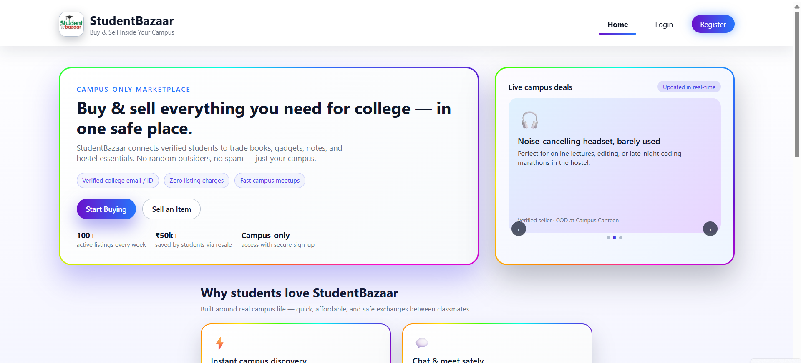

###  Authentication
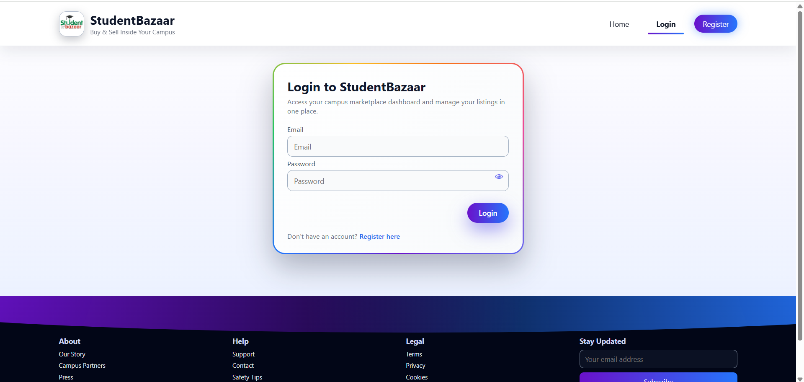
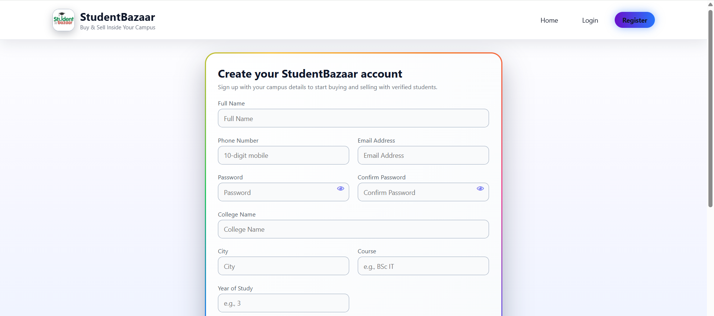

### Product Browsing
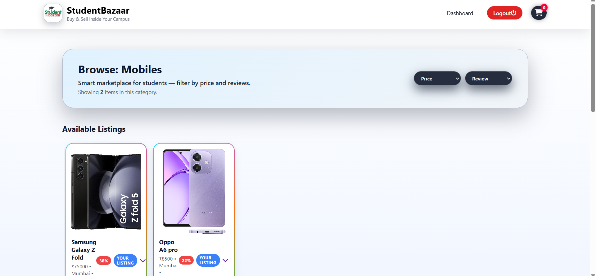
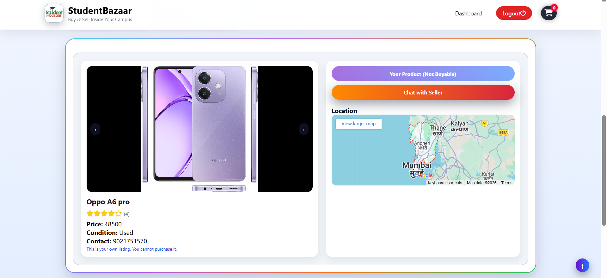
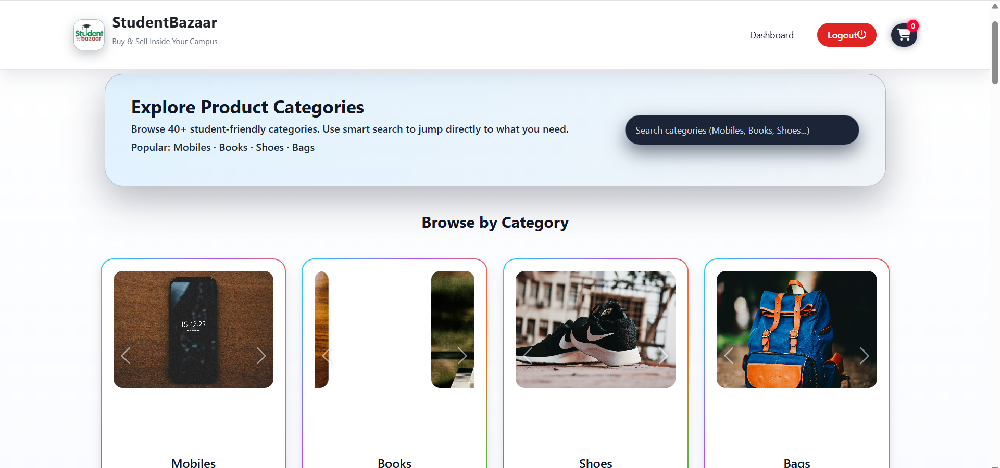
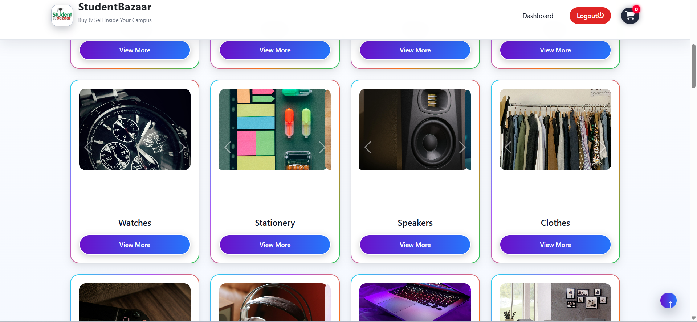

###  Cart & Purchase Flow
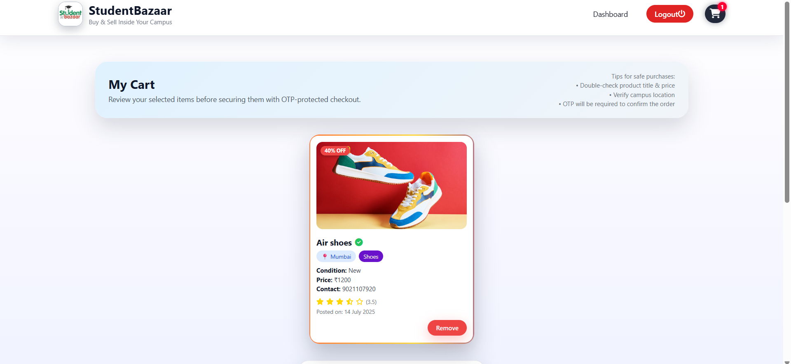

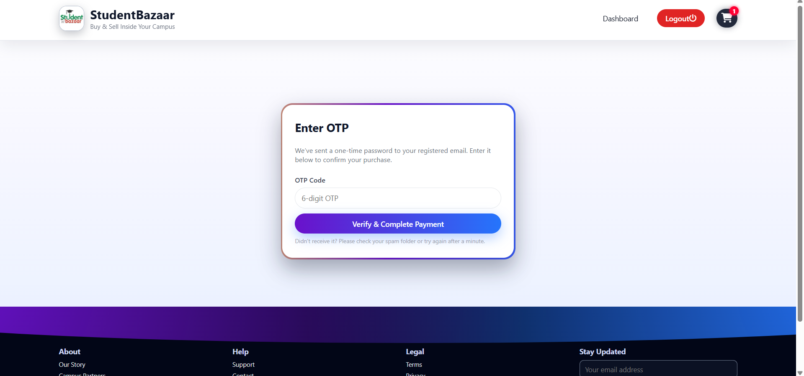
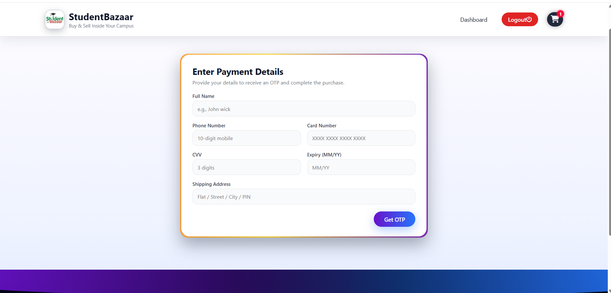

###  Selling & Listings
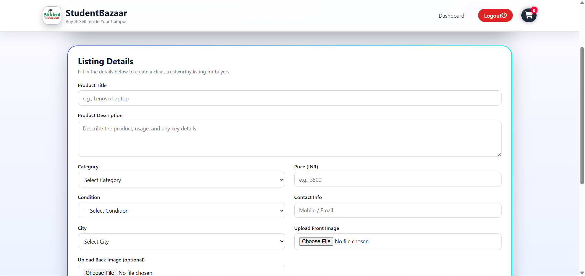
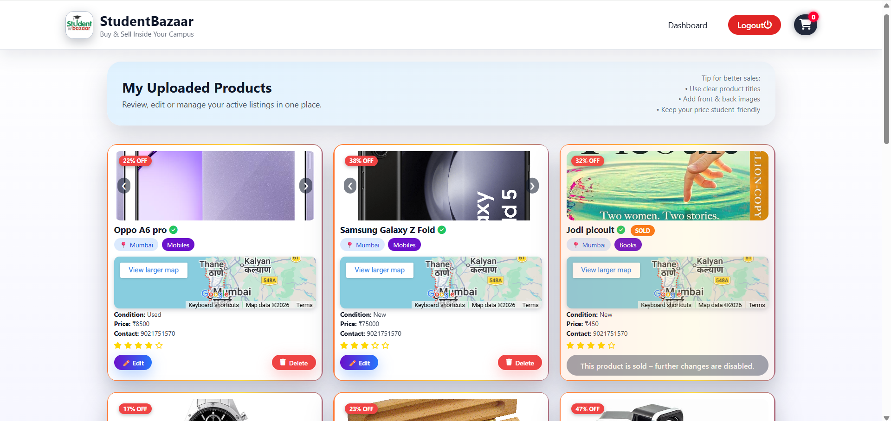

###  Dashboard
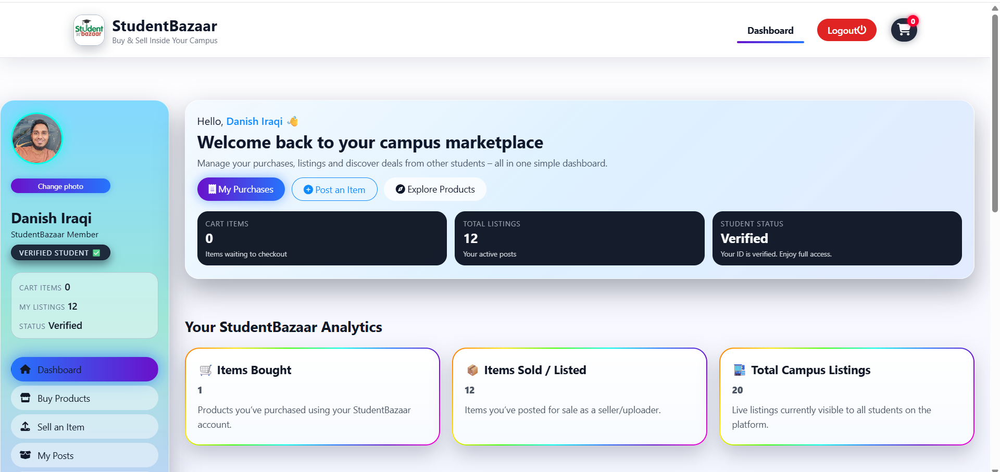
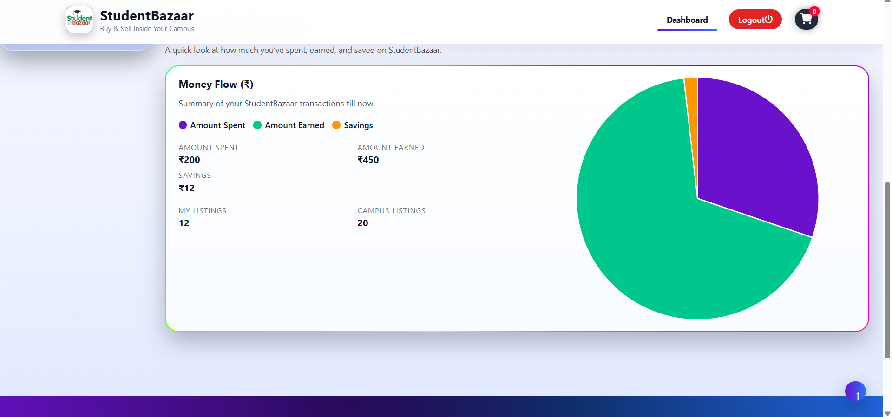

###  Admin Panel
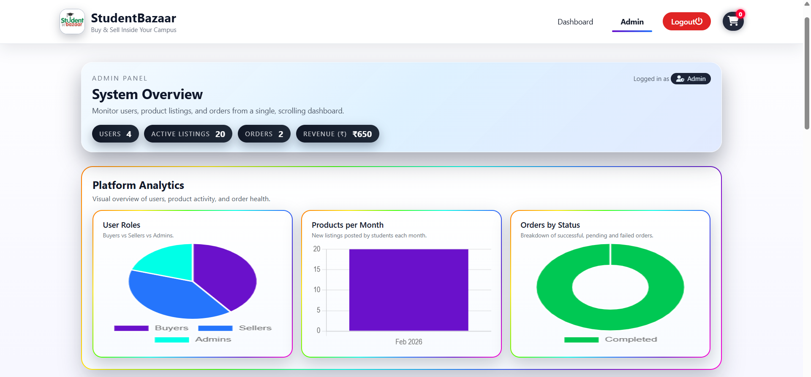
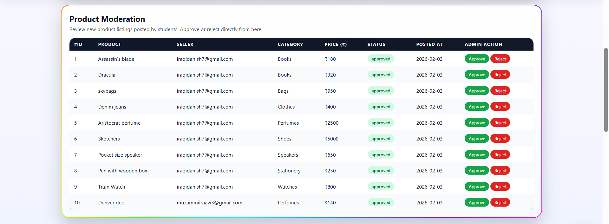
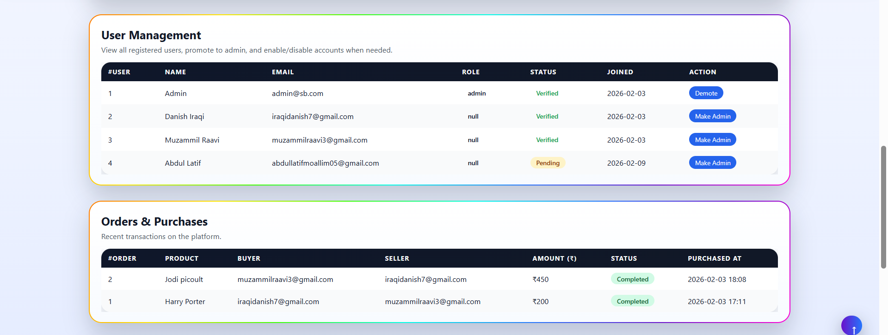

---

##  How to Run

1. Import project in Eclipse  
2. Configure Apache Tomcat Server  
3. Setup MySQL database  
4. Run project on server  

---

##  Future Improvements

- OCR-based student verification  
- Payment integration  
- Notifications system  
- Advanced analytics dashboard  

---
